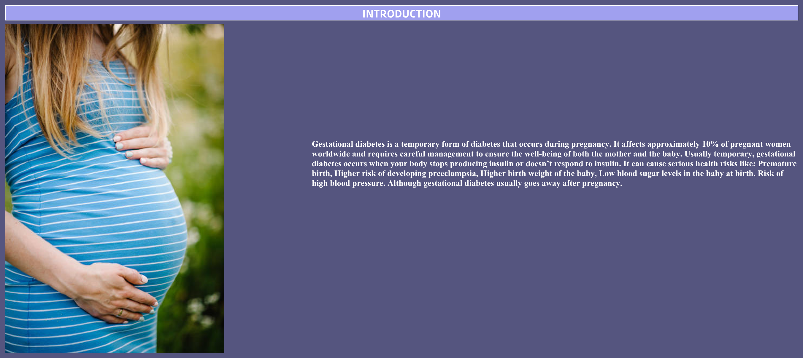

# Gestational Diabetes Analysis Dashboard (Tableau)

This Tableau dashboard project provides a detailed analysis of **Gestational Diabetes (GDM)**, a temporary form of diabetes that occurs during pregnancy. The dashboard highlights the prevalence, risks, and health impacts of GDM, aiming to spread awareness and showcase how data visualization can help in healthcare analysis.

## 📌 Project Overview
Gestational Diabetes affects about **10% of pregnant women worldwide**. This condition requires close monitoring and management to ensure the health and well-being of both the mother and the baby.  

The dashboard provides insights into:
- **Prevalence of GDM** among pregnant women.  
- **Health risks and complications** for mother and baby.  
- **Key factors contributing to GDM**.  
- **Potential preventive measures and outcomes**.  

## 🎯 Project Objectives
The primary objectives of this project are:
- To raise **awareness of gestational diabetes** and its impact.  
- To visualize **risk factors** such as premature birth, preeclampsia, and high birth weight.  
- To analyze **health outcomes** associated with GDM for both mothers and newborns.  
- To demonstrate the role of **data analytics in healthcare decision-making**.  

## 📊 Dashboard Insights
- **Gestational Diabetes Prevalence**: Affects approximately 10% of pregnant women globally.  
- **Health Risks**: Includes premature birth, preeclampsia, higher birth weight, neonatal low blood sugar, and increased maternal blood pressure.  
- **Temporary Condition**: Usually resolves after pregnancy but poses long-term health risks if unmanaged.  
- **Mother & Baby Impact**: Directly affects newborn health outcomes and maternal recovery.  

## ✅ Final Conclusion
This Tableau dashboard shows that:  
- Gestational diabetes is a **significant but often temporary condition** during pregnancy.  
- **Careful monitoring and management** are essential to reduce risks for both mother and baby.  
- Data visualization can help **health professionals and patients better understand risks**, track conditions, and encourage preventive care.  

## 🛠 Tools Used
- **Tableau** (Interactive Dashboard & Visual Analytics)  
- **Healthcare Dataset** on Gestational Diabetes  

## 🔗 Connect
For more projects and updates, visit my profiles:  

- GitHub: [Keerthi's GitHub Profile](https://github.com/Keerthikadiyala91)  
- LinkedIn: [Keerthi's LinkedIn Profile](https://www.linkedin.com/in/keerthi-k-47868154/)
- Tableau:  [Keerthi's LinkedIn Profile](https://public.tableau.com/app/profile/keerthi5467/viz/Gestational_Diabetes_17286814918000/INTRODUCTION)
